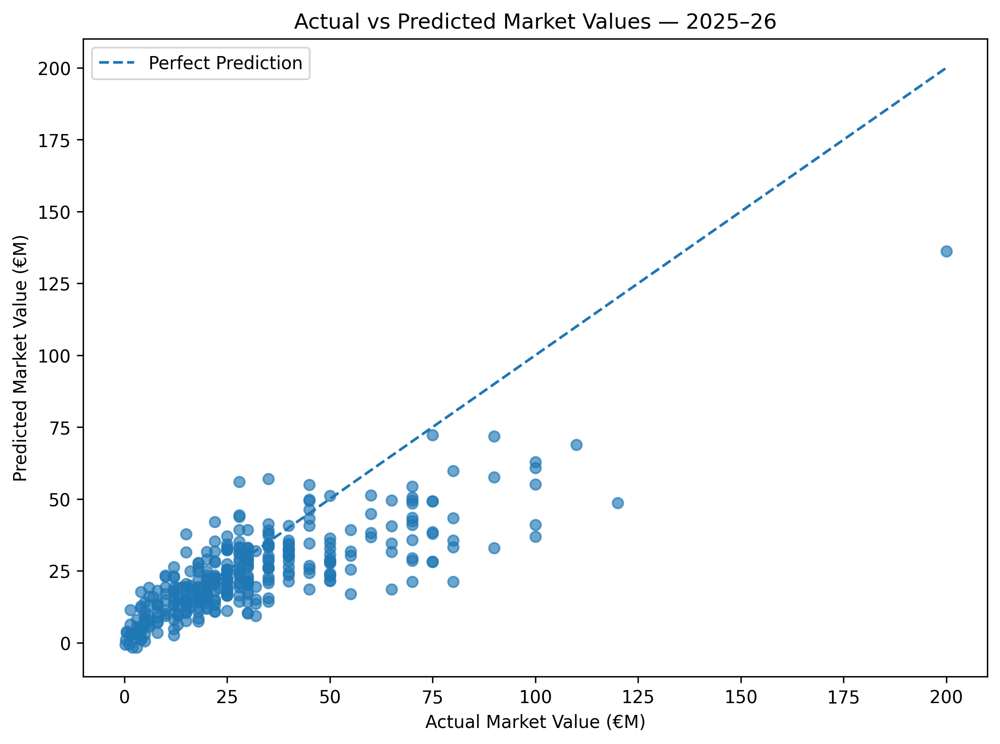
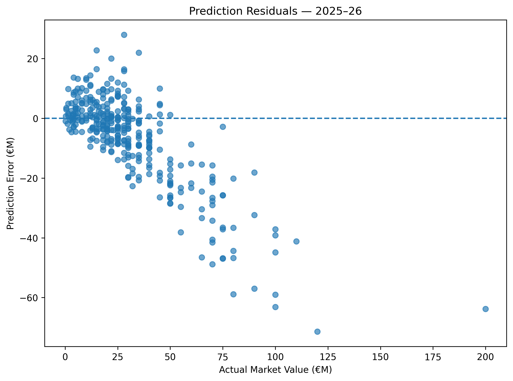
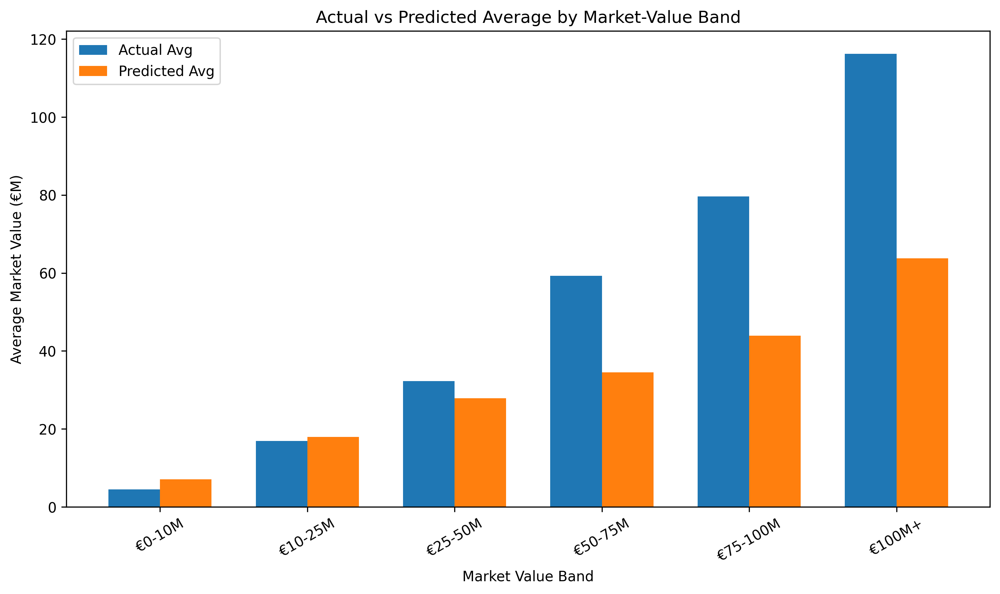
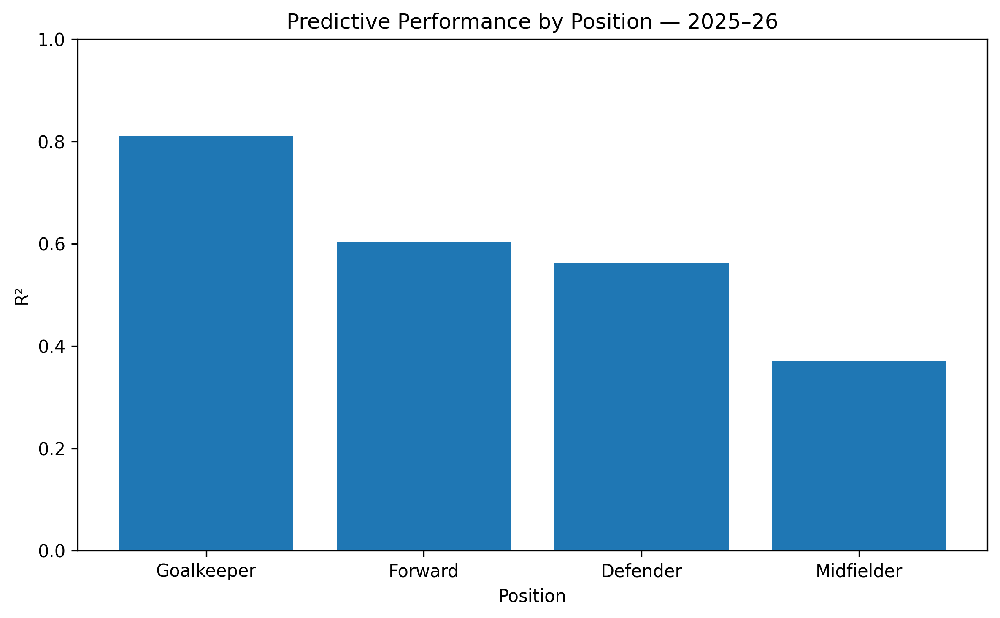
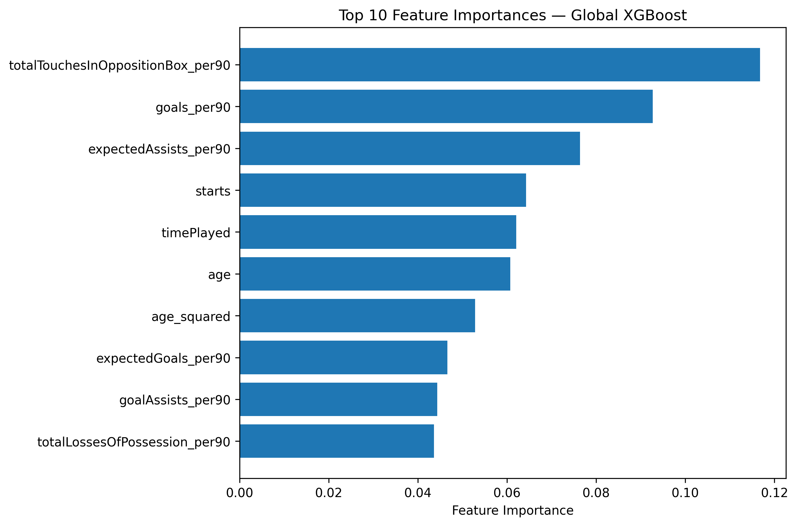
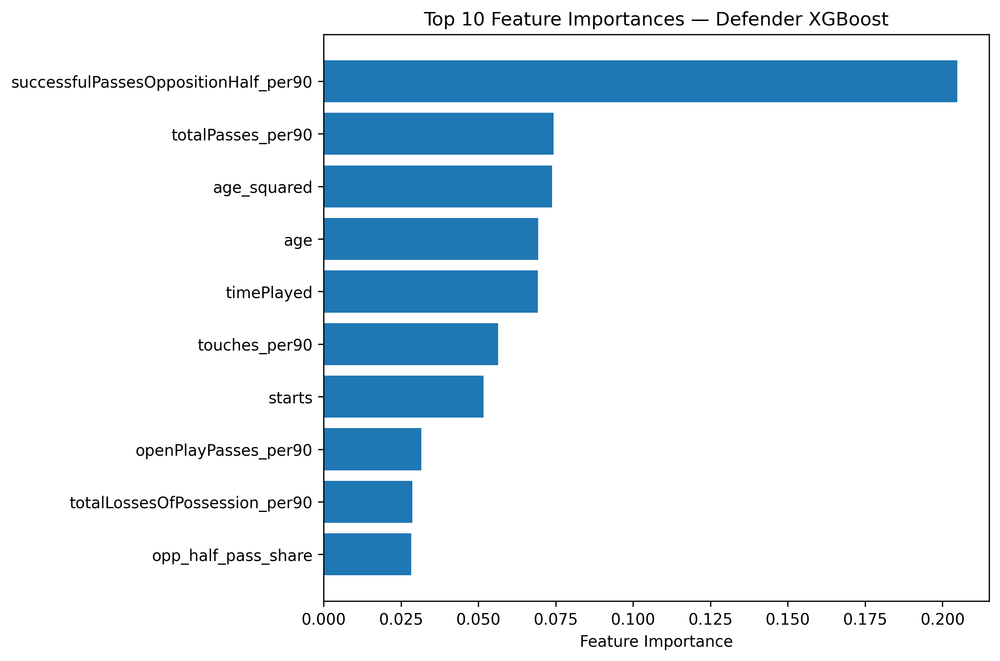

# Premier League Player Market Value Predictor

A machine learning project that estimates Premier League player market values from performance, age, playing time, and position-specific football metrics.

The project uses six Premier League seasons, from **2020–21 through 2025–26**, combines player performance data with Transfermarkt-derived market valuations, engineers role-specific features, and compares multiple regression approaches before selecting a final hybrid XGBoost architecture.

---

## Project Overview

Football market values are influenced by both measurable performance and less tangible factors such as reputation, potential, contract situation, club context, and transfer demand.

This project asks:

> **How accurately can a player's market value be estimated using observable Premier League performance data?**

The modelling pipeline was designed to avoid relying on a single season or a random train/test split. Instead, it uses a chronological development, validation, and final-test setup.

---

## Final Result

The final hybrid model was selected using **2024–25 as the validation season** and then evaluated on **2025–26**.

| Metric | Final Hybrid Model |
|---|---:|
| MAE | **€10.85M** |
| RMSE | **€16.56M** |
| R² | **0.537** |

The final architecture uses:

- **Forwards:** Global XGBoost model
- **Midfielders:** Global XGBoost model
- **Defenders:** Defender-specific XGBoost model
- **Goalkeepers:** Global XGBoost model

A fully position-specific model reached a stronger exploratory result of **R² = 0.614**, MAE = **€9.92M**, and RMSE = **€15.13M**, but that result is reported separately because the 2025–26 season had already been inspected during model development. The hybrid result above is the more defensible final benchmark after using 2024–25 for architecture selection.

---

## Dataset

The project combines two main data sources:

### Player performance data

Season-level Premier League player statistics from:

- `2020-21_players_stats.csv`
- `2021-22_players_stats.csv`
- `2022-23_players_stats.csv`
- `2023-24_players_stats.csv`
- `2024-25_players_stats.csv`
- `2025-26_players_stats.csv`

The raw season files contain more than 130 player metrics, including attacking, passing, possession, defensive, duel, and goalkeeper statistics.

### Market value data

Transfermarkt-derived data from:

- `player_valuations.csv`
- `players.csv`

These files provide player IDs, player names, dates of birth, club information, historical market valuations, and valuation dates.

---

## Data Preparation

The final dataset was built using the following process:

1. Filter Transfermarkt records to Premier League players.
2. Keep player performance rows with at least **900 minutes played**.
3. Normalize player names to handle accents, punctuation, and spelling variations.
4. Apply manual mappings for known naming differences.
5. Resolve ambiguous names using Transfermarkt player IDs.
6. Use the latest market valuation inside each season window.
7. Calculate player age at the valuation date.
8. Convert event-count statistics to **per-90-minute features**.
9. Remove unresolved player matches.
10. Collapse duplicate player-season records caused by multiple club labels while preserving the same season totals.

The final cleaned dataset contains:

> **1,970 player-season observations**

### Rows by season

| Season | Player-seasons |
|---|---:|
| 2020–21 | 322 |
| 2021–22 | 336 |
| 2022–23 | 330 |
| 2023–24 | 336 |
| 2024–25 | 310 |
| 2025–26 | 336 |

---

## Feature Engineering

### Core features

The global model uses variables such as:

- age
- age squared
- games played
- starts
- minutes played
- goals per 90
- assists per 90
- expected goals per 90
- expected assists per 90
- shots per 90
- key passes per 90
- successful dribbles per 90
- touches in the opposition box per 90
- tackles
- interceptions
- blocks
- clearances
- duels won
- recoveries
- losses of possession

### Position-specific features

Additional features were engineered for different roles.

#### Midfield
- total passes per 90
- successful passes in the opposition half
- successful passes in own half
- successful long passes
- through balls
- open-play passes
- touches
- second assists
- opposition-half pass share
- own-half pass share
- long-pass share

#### Defence
- tackle win rate
- aerial duel win rate
- interceptions
- blocks
- clearances
- recoveries
- aerial duels
- passing volume
- opposition-half passing
- long passing

#### Goalkeeping
- clean sheets per 90
- clean-sheet rate
- goals conceded per 90
- expected goals on target conceded per 90
- shot-stopping overperformance
- penalty goals conceded
- distribution volume
- distribution success rate
- long-pass share

---

## Exploratory Data Analysis

The target distribution is strongly right-skewed. Most Premier League player-seasons fall below approximately €40M, while a small group of elite players reaches values above €100M.

Age also shows a nonlinear relationship with market value: valuations generally peak around the early-to-mid 20s and fall for older players.

Among the strongest simple correlations with market value were goals per 90, expected goals per 90, expected assists per 90, touches in the opposition box per 90, total shots per 90, assists per 90, and key passes per 90.

---

## Model Development

| Model | MAE (€M) | RMSE (€M) | R² | Evaluation note |
|---|---:|---:|---:|---|
| Linear Regression | 12.86 | 18.70 | 0.410 | 2025–26 test |
| Log-Target Linear Regression | 12.38 | 18.60 | 0.417 | 2025–26 test |
| Random Forest | 11.42 | 17.25 | 0.498 | 2025–26 test |
| Global XGBoost | 11.28 | 17.16 | 0.504 | 2025–26 test |
| Position-Specific XGBoost | 9.92 | 15.13 | 0.614 | Best exploratory result |
| Final Hybrid XGBoost | **10.85** | **16.56** | **0.537** | Final validation-selected architecture |

---

## Validation Strategy

### Development
- 2020–21
- 2021–22
- 2022–23
- 2023–24

### Validation
- 2024–25

### Final test
- 2025–26

This setup better reflects the real-world task of using past seasons to estimate values in a future season.

---

## Global vs Position-Specific Models

On the 2024–25 validation season:

| Model | MAE (€M) | RMSE (€M) | R² |
|---|---:|---:|---:|
| Global XGBoost | 10.80 | 15.88 | 0.559 |
| Fully position-specific XGBoost | 10.42 | 16.35 | 0.532 |
| **Hybrid model** | **10.12** | **15.26** | **0.592** |

The position-by-position comparison showed that the defender-specific model added clear value, while the global model generalized better for the other positions.

---

## Final Test Performance by Position

| Position | Players | MAE (€M) | RMSE (€M) | R² |
|---|---:|---:|---:|---:|
| Forward | 79 | 12.99 | 18.74 | 0.603 |
| Midfielder | 109 | 14.14 | 20.68 | 0.371 |
| Defender | 124 | 7.87 | 11.73 | 0.562 |
| Goalkeeper | 24 | 4.29 | 5.63 | 0.810 |

---

## Error Analysis

| Actual value band | Players | Actual average (€M) | Predicted average (€M) | MAE (€M) | Bias (€M) |
|---|---:|---:|---:|---:|---:|
| €0–10M | 51 | 4.48 | 7.10 | 3.92 | +2.61 |
| €10–25M | 102 | 16.87 | 17.98 | 5.26 | +1.10 |
| €25–50M | 121 | 32.23 | 27.84 | 8.17 | -4.39 |
| €50–75M | 39 | 59.23 | 34.52 | 24.77 | -24.71 |
| €75–100M | 15 | 79.67 | 43.92 | 35.74 | -35.74 |
| €100M+ | 8 | 116.25 | 63.78 | 52.47 | -52.47 |

The model systematically underpredicts elite players.

---

## Visualisations

### Actual vs Predicted Market Value


### Prediction Residuals


### Actual vs Predicted by Market-Value Band


### R² by Position


### Global XGBoost Feature Importance


### Defender Model Feature Importance


---

## Final Model Architecture

```text
Player
  |
  |-- Defender --> Defender-specific XGBoost
  |
  |-- Forward ----\
  |-- Midfielder --+--> Global XGBoost
  |-- Goalkeeper --/
  |
  --> Estimated Market Value
```

---

## Repository Structure

```text
premier-league-market-value-predictor/
│
├── README.md
├── notebooks/
│   └── premier_league_market_value_model.ipynb
│
├── data/
│   ├── premier_league_market_value_master.csv
│   └── final_2025_26_predictions.csv
│
├── models/
│   ├── final_global_model.pkl
│   └── final_defender_model.pkl
│
├── results/
│   └── model_comparison.csv
│
├── plots/
│   ├── actual_vs_predicted.png
│   ├── residual_plot.png
│   ├── actual_vs_predicted_by_band.png
│   ├── r2_by_position.png
│   ├── global_feature_importance.png
│   └── defender_feature_importance.png
│
└── requirements.txt
```

---

## Tech Stack

- Python
- Pandas
- NumPy
- Matplotlib
- scikit-learn
- XGBoost
- Joblib
- Google Colab

---

## How to Run

```bash
git clone https://github.com/Loag24ing/premier-league-market-value-predictor.git
cd premier-league-market-value-predictor
pip install -r requirements.txt
```

Then open the notebook and run the cells in sequence.

---

## Limitations

Important omitted factors include:

- contract duration
- wages
- transfer history
- international caps
- club financial strength
- player reputation
- injury history
- commercial value
- previous-season market value
- transfer-market demand

The model also systematically underestimates very high-value players.

---

## Future Improvements

1. Add previous-season market value as a lagged feature.
2. Add contract and transfer-history variables.
3. Include international appearances and national-team performance.
4. Add player injury history.
5. Engineer more role-specific metrics.
6. Investigate more granular positions.
7. Try LightGBM or CatBoost.
8. Use SHAP values for explainability.
9. Build an interactive Streamlit prediction dashboard.
10. Test the frozen model on a genuinely unseen future Premier League season.

---

## Key Takeaway

The final hybrid model achieved:

> **MAE: €10.85M · RMSE: €16.56M · R²: 0.537**

on the 2025–26 evaluation season, while analysis showed that the largest remaining errors are concentrated among elite, high-value players.

---

## Author

**Nirjhar Roy Sarkar**  
Jadavpur University
